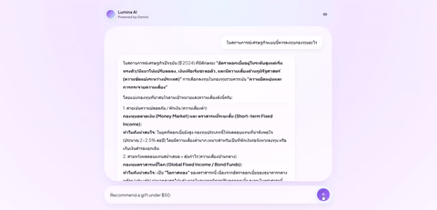

# Lumina AI

A chat interface over Google Gemini that remembers your conversations — sign in, chat, refresh the page, and it's still there. Built across Lab 1 (LangChain-free basics, prompting, full-stack API integration) and Lab 2 (persistence, caching, auth) of an AI engineering track.

```
Frontend (React + Vite) → Backend (FastAPI, JWT-gated) → Postgres (conversation history)
                                                        ↘ Redis (history cache)
                                                        ↘ Gemini API (history sent as context)
```

## Demo

Voice output in action — Lumina reads its own replies out loud, switching voice between Thai and English mid-sentence:



## What it does

- **Chat UI** — messages appear as left/right bubbles, Gemini's replies rendered from Markdown (headings, bold, lists) instead of raw `###`/`**` symbols.
- **Voice output (TTS)** — every reply can be read aloud via the browser's Web Speech API. Thai and English are auto-detected per segment so mixed-language replies don't get mispronounced in the wrong accent. Each message has a replay/stop button, and a global toggle turns auto-speak on/off.
- **Suggested prompts** — a few starter chips so a new chat isn't a blank box.
- **Graceful errors** — free-tier Gemini quota exhausted (429) and upstream Gemini outages (5xx) surface as readable in-chat error messages instead of a silent failure.
- **Auth + memory** — a blocking login/register modal gates the chat behind a JWT. Every message is persisted to Postgres under the signed-in user's conversation, and the full history is replayed to Gemini as context on each turn — refresh the page and the conversation is still there. History reads go through a Redis cache-aside layer, invalidated on every new message.

## Stack

- **Backend:** FastAPI + [google-genai](https://pypi.org/project/google-genai/) SDK (model `gemini-3.6-flash`), SQLAlchemy + Postgres for conversation storage, Redis for history caching, JWT (`python-jose`) + `bcrypt` for auth
- **Frontend:** React (Vite), Tailwind CSS, `react-markdown`
- **Design system:** "Ethereal Glass Lumina" — documented in [`DESIGN.md`](DESIGN.md); product rationale in [`PRODUCT.md`](PRODUCT.md)

## Running locally

### 1. Postgres + Redis

```bash
docker compose up -d
```

Starts both on their default ports with the credentials `main.py` expects out of the box (see `docker-compose.yml`).

### 2. Backend

```bash
cd backend
python -m venv venv
source venv/bin/activate      # Windows: venv\Scripts\activate
pip install -r requirements.txt
cp .env.example .env          # fill in GOOGLE_API_KEY and JWT_SECRET
uvicorn main:app --reload
```

Get a free Gemini API key at [aistudio.google.com](https://aistudio.google.com) → Get API Key. `JWT_SECRET` can be any long random string — it signs login tokens, so treat it as a real secret and never reuse the `.env.example` placeholder.

### 3. Frontend

```bash
cd frontend
npm install
cp .env.example .env          # VITE_API_URL points at the backend
npm run dev
```

Opening the app shows a login modal over a blurred, inert chat behind it — register a username/password (stored as a bcrypt hash, never plaintext) to get in.

## Deploy

- Backend → Railway (root directory `backend`, set `GOOGLE_API_KEY`, `DATABASE_URL`, `REDIS_URL`, `JWT_SECRET` env vars). Managed Postgres/Redis (e.g. Neon, Upstash, or Railway's own add-ons) replace the local `docker-compose.yml` pair here.
- Frontend → Vercel (root directory `frontend`, set `VITE_API_URL` env var to the Railway URL)
